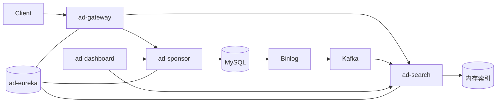

# 广告投放与检索微服务（Spring Cloud）

## 项目简介
面向广告平台的写端 + 读端后端。写端负责广告主的用户、计划、单元、创意及定向维度 CRUD；读端在 JVM 内维护倒排索引并提供多维过滤检索；注册中心与网关负责服务发现与流量入口，Dashboard 提供熔断监控。

## 功能说明
- 服务注册与发现：Eureka Server + Client。
- 网关路由与日志：Zuul 入口，前置时间记录与后置耗时日志。
- 写入域（ad-sponsor）：用户/计划/单元/创意 CRUD，关键词/地域/兴趣/创意关联等定向维度管理。
- 检索域（ad-search）：内存索引加载与增量更新（Binlog→Kafka→索引），支持 positionType + AND/OR 多维过滤返回创意。
- 监控：Hystrix Dashboard 观察熔断与调用健康。

## 技术栈
- Spring Boot 2.0.2、Spring Cloud Finchley（Eureka、Zuul、Feign、Ribbon、Hystrix/Hystrix Dashboard）
- MySQL + Binlog、Kafka（增量链路）
- JPA、Lombok、Fastjson

## 架构图

## 目录说明
- `ad-eureka`：Eureka Server 注册中心。
- `ad-gateway`：Zuul 网关，`PreRequestFilter`/`AccessLogFilter` 记录耗时。
- `imooc-ad-service/ad-common`：统一响应/异常、注解、拦截器、dump 常量。
- `imooc-ad-service/ad-sponsor`：写入域，CRUD + 事务校验。
- `imooc-ad-service/ad-search`：检索域，索引维护、Binlog/Kafka 增量、检索接口。
- `imooc-ad-service/ad-dashboard`：Hystrix Dashboard 监控。
- `mysql_data`：样例数据。

## 核心逻辑（高层）
1) 写入：客户端经 Zuul 调用 ad-sponsor，完成参数校验、唯一性校验、事务写库（软删除）。  
2) 增量：MySQL Binlog → 监听解析 → Kafka → ad-search handler 更新内存倒排索引。  
3) 检索：ad-search 根据广告位 positionType 预筛单元，按关键词/地域/兴趣 AND/OR 过滤，校验计划/单元状态，关联创意并按尺寸/类型过滤后返回。

## 快速启动
1. 准备基础设施：MySQL（开启 Binlog）、Kafka；导入 `mysql_data` 样例数据。
2. 依次启动：
   - `ad-eureka`（注册中心）
   - `ad-gateway`
   - `imooc-ad-service/ad-sponsor`
   - `imooc-ad-service/ad-search`
   - `imooc-ad-service/ad-dashboard`
3. 网关访问：默认 Zuul 端口查看 `application.yml`；通过 Zuul 转发访问各服务接口。

## 测试方式
- 写入接口：通过 Postman/HTTP 请求调用 ad-sponsor 的 `/create/*`、`/update/*`、`/delete/*` 等路由（可经 Zuul 转发）。
- 检索接口：调用 ad-search 的检索 API（示例请求见 `ad-search/src/main/resources/request`）。
- 监控：访问 Hystrix Dashboard（ad-dashboard）输入 Hystrix Stream 观察断路器。

## 扩展方向
- 完善降级结果与统一错误码。
- 索引过滤可加入排序/多样性策略而非随机选一。
- 增量链路增加幂等校验与重放能力。
- 配置与凭证集中化（如 Spring Cloud Config/Secret 管理）。 
