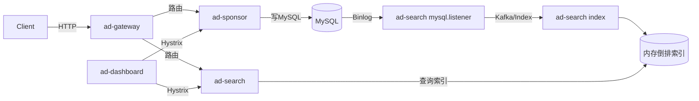

## 核心流程

### 整体调用链

### 写入端（ad-sponsor）
- 用户/计划/单元/创意/定向维度 CRUD 入口：`controller` -> `service` -> `dao`。
- 校验顺序：参数校验 → 关联实体存在性检查 → 唯一性校验 → JPA 保存（部分操作带事务）。
- 软删除：计划/单元等通过状态字段置无效。

### 检索端（ad-search）
- 启动时加载 dump 到内存索引；运行时监听 Binlog，经 Kafka/handler 更新内存索引。
- 请求路径：`SearchController`（由 `SearchImpl` 实现）接收 `SearchRequest`，按广告位 positionType 初筛单元，再根据特征（关键词/地域/兴趣）AND/OR 过滤，过滤状态，关联创意，按尺寸/类型匹配后返回。

### 网关与监控
- `PreRequestFilter` 记录开始时间，`AccessLogFilter` 在 POST 阶段计算耗时输出日志。
- `ad-dashboard` 通过 Hystrix Dashboard 观察断路器状态。

